<!-- _class: hero -->

# SESSION 1
## Prompt Engineering Industry Standards & Practical Application

**From Ad-Hoc AI Prompting to Structured, Reusable Workflows**


---

## Session Overview

**Duration:** 90 minutes


---

## Prerequisites

- ✅ AI tool installed (GitHub Copilot, Claude, Cursor, or Windsurf)
- ✅ spring-migration-demo repository cloned
- ✅ Text editor or IDE
- ✅ Basic understanding of Spring Boot

---

## Learning Objectives

By the end of this session, you will:

1. **Understand** industry-standard prompt engineering patterns
   - Few-shot, Chain-of-Thought, Persona, Template
2. **Learn** configuration management standards
   - `.github/copilot-instructions.md`, `.windsurfrules`
3. **Explore** decision documentation approaches
   - ADRs vs structured prompts
4. **Compare** freestyle vs templated approaches
   - Hands-on experimentation
5. **Recognize** multiple valid approaches exist
   - ADRs, Spec-Kit, custom patterns

## The Problem: Ad-Hoc AI Prompting

**Current State for Most Developers:**

```mermaid
flowchart LR
    DEV1[👨‍💻 Developer:<br/>"Migrate to Spring Boot 3"] --> AI1[🤖 AI generates code]
    AI1 --> DEV2[👨‍💻 "Not quite right...<br/>try again"]
    DEV2 --> AI2[🤖 Generates different code]
    AI2 --> DEV3[👨‍💻 "Still missing patterns...<br/>explain more..."]
    DEV3 -.->|Repeat cycle| DEV1

    style DEV1 fill:#FFB74D,stroke:#F57C00,color:#000
    style DEV2 fill:#FFB74D,stroke:#F57C00,color:#000
    style DEV3 fill:#ef5350,stroke:#c62828,color:#fff
    style AI1 fill:#f0f0f0,stroke:#999
    style AI2 fill:#f0f0f0,stroke:#999
```

**Problems:**
- ❌ Every prompt starts from scratch
- ❌ No shared team knowledge in prompts
- ❌ Inconsistent results across files
- ❌ Can't track what worked vs what didn't
- ❌ Becomes "vibe coding" (accepting unreviewed AI output)

**The Solution:**

```mermaid
flowchart TD
    STRUCT[📋 Structured Patterns] --> VERSIONED[📦 Version Controlled]
    VERSIONED --> REUSE[♻️ Reusable Templates]
    REUSE --> CONSISTENT[✅ Consistent Results]

    style STRUCT fill:#A100FF,stroke:#A100FF,color:#fff
    style VERSIONED fill:#4A90E2,stroke:#4A90E2,color:#fff
    style REUSE fill:#7ED321,stroke:#7ED321,color:#fff
    style CONSISTENT fill:#7ED321,stroke:#7ED321,color:#fff
```



---

<!-- _class: break -->

## 🔄 Engagement Check

**Show of hands:**

*"Who has used Architecture Decision Records (ADRs) before?"*

## Tier 1: Proven Patterns

**10+ years, production-ready**

**Tier 1: Proven Patterns (10+ years, production-ready)**


**Key Insights:**
- ADRs: Document the WHY, not just the WHAT
- RFC: Async collaboration, builds consensus

## Tier 2 & 3: Emerging Standards

```mermaid
flowchart TD
    subgraph TIER2["⚡ Tier 2: Emerging (1-3 years)"]
        COPILOT[.github/copilot-instructions.md<br/>⭐ Cross-IDE, Recommended]
        WINDSURF[.windsurfrules<br/>Windsurf-specific]
        CURSOR[.cursorrules<br/>Cursor-specific]
    end

    subgraph TIER3["🔬 Tier 3: Experimental (months-2 years)"]
        SPECKIT[Spec-Kit<br/>AI-assisted specs]
        CUSTOM[Custom Workflows<br/>Team-specific patterns]
    end

    COPILOT -.->|Most compatible| WINNER[✅ Recommended Choice]

    style COPILOT fill:#A100FF,stroke:#A100FF,color:#fff
    style WINDSURF fill:#4A90E2,stroke:#4A90E2,color:#fff
    style CURSOR fill:#4A90E2,stroke:#4A90E2,color:#fff
    style SPECKIT fill:#FFB74D,stroke:#F57C00,color:#000
    style CUSTOM fill:#FFB74D,stroke:#F57C00,color:#000
    style WINNER fill:#7ED321,stroke:#7ED321,color:#fff
```



**Tier 2 Key Insights:**
- `.github/copilot-instructions.md` ⭐: Works across VS Code, Visual Studio, JetBrains, Xcode
- `.windsurfrules`: Windsurf IDE only (lock-in risk)
- `.cursorrules`: Cursor IDE only, 3,000+ community forks

**Tier 3: Experimental Tools**
- **GitHub Spec-Kit** (released Sept 2024, ~14 months old as of Nov 2025)
  - Structured workflow: Constitution → Specify → Plan → Tasks → Implement
  - Positions as antidote to "vibe coding chaos"
  - Status: Interesting experiment, growing understanding, not yet proven at scale
  - Concerns: Can feel like waterfall, verbose for small tasks (Martin Fowler analysis)

---

### 🔄 ACTIVE CHOICE (1 min)

**Quick poll:** "Which tier interests you most - Tier 1 (ADRs), Tier 2 (config files), or Tier 3 (Spec-Kit)?"

*This micro-break creates cognitive investment through choice*

---

### Slide 3: Ad-Hoc vs Structured Workflows (6 min)

**What They Are:**
Natural language files telling AI tools how to work with your project

**`.github/copilot-instructions.md` Example** ⭐ (Cross-IDE, Recommended):
```markdown
# Team Copilot Instructions

## Spring Boot 3 Migration Standards

When working with controllers:
- Use jakarta.* imports (Spring 3+)
- Use specific HTTP method annotations (@GetMapping, @PostMapping)
- Follow REST conventions
- Constructor injection (no @Autowired)

## Tech Stack
- Spring Boot 3.2+
- Java 17+
- Jakarta EE (not javax)

See docs/adr/ for architecture decisions.
```

**`.windsurfrules` Example** (Windsurf IDE):
```markdown
# Project: Spring Boot Migration Helper

## Tech Stack
- Spring Boot 3.2+, Java 17+, Jakarta EE

## Standards
- DRY, KISS, YAGNI
- Constructor injection only
- Specific HTTP annotations (@GetMapping not @RequestMapping)

## Avoid
- Deprecated javax.* packages
- @Autowired with @RequiredArgsConstructor
```

**Key Benefits:**
- ✅ Team-shared knowledge (version controlled)
- ✅ Consistent AI behavior across developers
- ✅ Reusable across projects

## Evolution: ADRs to Structured Prompts

```mermaid
flowchart LR
    subgraph OPTION_A["📋 Option A: ADRs (Industry Standard)"]
        ADR_STRUCT[Structure:<br/>Status, Context, Decision, Consequences]
        ADR_WHERE[Location:<br/>docs/adr/0001-*.md]
        ADR_WHO[Used by:<br/>Microsoft, AWS, Netflix]
    end

    subgraph OPTION_B["🔬 Option B: Structured Prompts (Experimental)"]
        PROMPT_STRUCT[Structure:<br/>Rules, Transformations, Criteria]
        PROMPT_WHERE[Location:<br/>prompts/ or spec/]
        PROMPT_WHO[Used by:<br/>AI-first teams, experimental]
    end

    CHOOSE{Your Choice}
    ADR_STRUCT --> CHOOSE
    PROMPT_STRUCT --> CHOOSE

    CHOOSE -->|Proven, lightweight| PICK_A[✅ Choose ADRs]
    CHOOSE -->|More detail, AI-focused| PICK_B[⚡ Choose Prompts]
    CHOOSE -->|Best of both| PICK_C[💡 Use Both Together]

    style CHOOSE fill:#A100FF,stroke:#A100FF,color:#fff
    style PICK_A fill:#7ED321,stroke:#7ED321,color:#fff
    style PICK_B fill:#4A90E2,stroke:#4A90E2,color:#fff
    style PICK_C fill:#FFB74D,stroke:#F57C00,color:#000
```



**Example ADR:**
```markdown
# ADR 0001: Use Jakarta EE for Spring 3 Migration
Status: Accepted
Context: Spring Boot 2.7 → 3.2 requires javax.* → jakarta.*
Decision: Systematic import replacement
Consequences: ✅ Compatible, future-proof | ❌ Breaking change
```

**Example Structured Prompt:**
```markdown
# System Prompt: Spring Migration Rules
Rules: javax.* → jakarta.*, @RequestMapping → @GetMapping
Criteria: Compiles with Spring 3.2, tests pass, no warnings
```

**Both Are Valid!**
- ADRs: Proven, widely adopted, documents WHY
- Structured prompts: Newer, focuses on HOW for AI generation
- Can use BOTH together (ADRs document decisions, prompts guide AI)

---

### Slide 5: Applying Standards - One Practical Example (2 min)

**Today's Hands-On: 5-File Workflow Pattern**

We'll apply industry standards through a practical workflow:

```
File 1: System Prompt (maps to: .github/copilot-instructions.md, persona pattern)
  └─ Reusable rules for ALL files

File 2: Task Specification (maps to: template pattern, structured output)
  └─ WHAT needs to change in THIS file

File 3: Execution Plan (maps to: task decomposition, ReAct pattern)
  └─ HOW to break work into phases

File 4: Decision Documentation (maps to: ADR, alternatives analysis)
  └─ WHY we chose approach X over Y

File 5: Code Generation (maps to: few-shot + chain-of-thought)
  └─ GENERATE using all context
```

**Key Insight:** This is ONE way to structure prompts. ADRs alone, Spec-Kit, or custom patterns are equally valid.

**Today's Goal:** Experience applying standards hands-on, then adapt to your workflow preferences.

---

## PART 2: SPRING BOOT DEMO (30-70 minutes)

### Prerequisites Check (Quick)

Before starting, verify:
- [ ] spring-migration-demo repository cloned
- [ ] Can access UserController.java in src/main/java/com/example/demo/controller/
- [ ] AI tool configured (Copilot/Claude/Cursor/Windsurf)

---

### Phase 1: Freestyle Experimentation (30-50 min = 20 min)

**Task:** Migrate UserController from Spring Boot 2.7 to Spring Boot 3.2

**Your Challenge:** Use your AI tool however you normally would. Try different prompting approaches.

**Required Changes:**
- javax.* → jakarta.* imports
- @RequestMapping → @GetMapping/@PostMapping/@PutMapping/@DeleteMapping
- Remove @Autowired from constructor (implicit in Spring 3)
- Preserve all 7 API endpoints

**Instructor Support:** Ask for hints/help as needed

**What to Observe:**
- How many iterations did you need?
- Did you get consistent results?
- How would you share your approach with teammates?
- Could you reuse this for the next controller?

---

### Phase 2: Show Guided Solution (50-60 min = 10 min)

**Instructor demonstrates:** Using 5-file template structure from spring-migration-demo (main branch)

**Files loaded:**
1. file-1-system-prompt.md (reusable rules - Persona pattern)
2. file-2-task-specification.md (this file's goals - Template pattern)
3. file-3-execution-plan.md (ordered steps - Task Decomposition)
4. file-4-decision-documentation.md (alternatives - ADR style)
5. file-5-code-generation.md (synthesis - Chain-of-Thought)

**Compare Results:**
- Freestyle: How many iterations? Consistency?
- Templated: First-try quality? Reusability?

**Key Insight:** Templates aren't always needed, but when they help, they really help.

---

### Phase 3: Apply Templates Yourself (60-70 min = 10 min)

**Your Turn:** Load the 5-file template structure and apply to SecurityConfig migration (or retry UserController with templates)

**Reference:** [demos/session-1-industry-standards/prompts/](https://github.com/josephrobertlopez/spring-migration-demo/tree/main/demos/session-1-industry-standards/prompts) in spring-migration-demo (main branch)

**Quick Validation:**
- Does code compile?
- Are all imports updated?
- No deprecated warnings?

---

## PART 3: REVIEW & DISCUSSION (70-90 minutes = 20 min)

### Group Debrief (10 min)

**Discussion Questions:**
- What worked better: freestyle or templated?
- When would you use templates? When wouldn't you?
- How could you adapt this to your team's workflow?
- What surprised you during the exercise?

**Key Takeaways:**
- Templates aren't always necessary (overhead vs value)
- Industry standards (ADRs, config files) provide foundation
- Choose approach based on task complexity and team needs
- Patterns (Persona, Few-shot, Chain-of-Thought) work across any structure

---

### Q&A (8 min)

Open floor for questions about:
- Prompt engineering patterns
- Configuration standards
- Decision documentation approaches
- Tool comparisons (Copilot, Claude, Cursor, Windsurf)

---

### Preview SESSION 2 (2 min)

**Next Session:** Advanced Patterns & Orchestration
- ReAct pattern (Think → Act → Observe cycles)
- Tree of Thoughts (exploring alternatives)
- Orchestrating multiple patterns for complex migrations
- spec/ folder approach (semantic structure)
- End-to-end code generation workflows

**Homework (Optional):** Experiment with `.github/copilot-instructions.md` or `.windsurfrules` in your projects

**Grounding in Standards:**
- **Persona Pattern**: We're assigning AI the role of "Spring migration specialist"
- **Few-shot Pattern**: We provide example transformations
- **Maps to**: `.github/copilot-instructions.md` (recommended) or `.windsurfrules` in real projects

**Template:**
```markdown
# System Prompt: Spring Boot 3 Migration Specialist

## Role (Persona Pattern)
You are an expert Spring Boot migration specialist helping teams upgrade from Spring Boot 2.7 to 3.2.

## Transformation Rules (Few-shot Pattern)

### Package Updates
BEFORE: import javax.validation.Valid;
AFTER:  import jakarta.validation.Valid;

BEFORE: import javax.servlet.http.*;
AFTER:  import jakarta.servlet.http.*;

### Annotation Modernization
BEFORE: @RequestMapping(value = "/users", method = RequestMethod.GET)
AFTER:  @GetMapping("/users")

BEFORE: @RequestMapping(value = "/users", method = RequestMethod.POST)
AFTER:  @PostMapping("/users")

### Dependency Injection
BEFORE:
```java
@Autowired
private UserService userService;
```

AFTER:
```java
@RequiredArgsConstructor  // Lombok
private final UserService userService;
```

## Quality Standards
- Code must compile with Spring Boot 3.2.x
- No deprecated API warnings
- All existing tests must pass
- API contracts unchanged (same URLs, request/response formats)

## DO NOT
- Change business logic
- Modify database schemas
- Alter API endpoint URLs
- Remove error handling

## Alternative Approaches

This could also be structured as:
- ADR 0001: Spring 3 Migration Standards
- .github/copilot-instructions.md (recommended, cross-IDE)
- .windsurfrules (Windsurf IDE)

Choose the format that fits your team's workflow.
```

**Success Criteria:**
- File exists with clear transformation rules
- Includes before/after examples (few-shot pattern)
- Assigns AI a role (persona pattern)
- Acknowledges alternative approaches (ADRs, config files)

---

### Step 2: Create Task Specification File (15 min)

**Goal:** Define specific file changes using Template pattern

**Reference:** [file-2-task-spec.md](https://github.com/josephrobertlopez/spring-migration-demo/blob/main/demos/session-1-industry-standards/prompts/file-2-task-spec.md) in spring-migration-demo (main branch)

**Grounding in Standards:**
- **Template Pattern**: Structured output format for AI
- **Chain-of-Thought**: Define success criteria AI can verify
- **Maps to**: Could be part of ADR or separate task ticket

**Template:**
```markdown
# Task Specification: UserController Migration

## File Target
- Path: `src/main/java/com/example/demo/controller/UserController.java`
- Current: Spring Boot 2.7 patterns with javax imports
- Goal: Spring Boot 3.2 compatible with jakarta imports

## Required Changes (Structured Template)

### 1. Package Updates
- [ ] Replace javax.validation.Valid with jakarta.validation.Valid
- [ ] Verify all javax.* imports updated to jakarta.*

### 2. Annotation Modernization
- [ ] Replace @RequestMapping(method=GET) with @GetMapping
- [ ] Replace @RequestMapping(method=POST) with @PostMapping
- [ ] Replace @RequestMapping(method=PUT) with @PutMapping
- [ ] Replace @RequestMapping(method=DELETE) with @DeleteMapping

### 3. Dependency Injection Verification
- [ ] Confirm @RequiredArgsConstructor present
- [ ] Confirm no @Autowired on fields or constructor
- [ ] Confirm UserService is final field

### 4. Endpoints to Preserve
Must maintain these exact URLs:
- GET    /api/users (list all users)
- GET    /api/users/active (list active users)
- GET    /api/users/{id} (get by ID)
- GET    /api/users/username/{username} (get by username)
- POST   /api/users (create user)
- PUT    /api/users/{id} (update user)
- DELETE /api/users/{id} (delete user)

## Success Criteria (Chain-of-Thought Verification)
1. Code compiles with Spring Boot 3.2 dependencies
2. All 7 API endpoints unchanged
3. All unit tests pass
4. No @Deprecated warnings
5. Exception handling preserved

## Alternative Documentation Approaches

This specification could also be:
- Part of ADR 0002: UserController Migration Details
- GitHub issue with acceptance criteria
- Jira ticket with technical requirements
- Inline comments in code review

Use the format your team prefers.
```

**Success Criteria:**
- Clear checklist of required changes
- Success criteria defined
- API contracts documented
- Acknowledges could be ADR/ticket instead

---

### Step 3: Create Execution Plan (Optional, 10 min)

**Goal:** Apply Task Decomposition pattern

**Reference:** [file-3-react-plan.md](https://github.com/josephrobertlopez/spring-migration-demo/blob/main/demos/session-1-industry-standards/prompts/file-3-react-plan.md) in spring-migration-demo (main branch) - optional

**Grounding in Standards:**
- **Task Decomposition**: Break complex work into ordered steps
- **ReAct Pattern**: Reason → Act → Observe cycle
- **Maps to**: Could be part of implementation plan in ADR

**Note:** This step is optional. Many teams skip formal execution plans for simple tasks and rely on ADRs + developer judgment.

**Template:**
```markdown
# Execution Plan: UserController Migration

## Why Execution Planning? (Optional for Simple Tasks)

For straightforward migrations, you might skip this and just:
- Follow the system prompt rules
- Check off task specification items
- Use developer judgment for ordering

For complex changes, breaking into phases helps catch issues early.

## Phase Breakdown (Task Decomposition Pattern)

### Phase 1: Imports (Est: 2 min)
**Reason:** Must compile before other changes
- Task: Replace javax.* with jakarta.*
- Validation: `mvn compile` succeeds

### Phase 2: Annotations (Est: 5 min)
**Reason:** Build on updated imports
- Task: Modernize @RequestMapping to specific HTTP methods
- Validation: No deprecated warnings

### Phase 3: Verification (Est: 3 min)
**Reason:** Confirm everything works
- Task: Run unit tests
- Validation: All tests green

## Alternative Approaches

Instead of this file, you could:
- Add "Implementation Steps" section to ADR
- Let AI figure out the order (Chain-of-Thought)
- Use developer judgment (for simple tasks)
- Follow team's standard migration runbook

This example shows how task decomposition works - use if helpful, skip if overkill.
```

**Success Criteria:**
- Phases logically ordered
- Each phase has validation checkpoint
- Acknowledges this is optional for simple tasks
- Shows alternative: add to ADR or skip entirely

---

### Step 4: Document Decisions (Optional - ADR vs Structured Prompt, 10 min)

**Goal:** Experience both ADR and structured decision formats

**Reference:** [file-4-tree-decisions.md](https://github.com/josephrobertlopez/spring-migration-demo/blob/main/demos/session-1-industry-standards/prompts/file-4-tree-decisions.md) in spring-migration-demo (main branch) - shows decision evaluation using Tree of Thoughts pattern

**Grounding in Standards:**
- **ADR Format**: Industry standard since 2011, widely adopted
- **Structured Decision Prompts**: Newer pattern for AI decision-making
- **Both are valid** - choose based on team preference

**Option A: ADR Format (Recommended for Production)**

```markdown
# ADR 0001: Exception Handling Strategy for Spring 3 Migration

## Status
Proposed

## Context
UserController currently uses try-catch blocks with ResponseEntity.badRequest() and ResponseEntity.notFound() for error handling. Spring Boot 3 introduced ProblemDetail (RFC 7807) for structured error responses.

We need to decide: Keep current pattern or adopt ProblemDetail?

## Decision
Keep current ResponseEntity pattern (minimal changes migration strategy).

## Rationale
- Current approach is functional and clear
- Migration focus is framework upgrade, not feature enhancement
- API clients don't currently need structured error responses
- Can revisit in future feature work (ADR 0010: Enhanced Error Responses)
- Reduces testing scope and migration risk

## Consequences
Positive:
- Minimal code changes reduces risk
- Faster migration completion
- Existing API contracts unchanged
- Clear separation: migration vs enhancement

Negative:
- Not using Spring 3 ProblemDetail feature
- Future enhancement will require separate change

## Alternatives Considered
- Option B: Adopt ProblemDetail (more changes, better structure)
- Option C: Full RFC 7807 with error catalog (over-engineered)
- Option D: Simple string messages (too basic)

## Related Decisions
- ADR 0002: Validation Strategy (keep current @Valid)
- ADR 0003: Dependency Injection Patterns
```

**Option B: Structured Decision Prompt Format (Experimental)**

```markdown
# Decision Documentation: UserController Migration

## Decision Point 1: Exception Handling Approach

**Context:**
UserController currently uses try-catch with ResponseEntity. Spring 3 offers ProblemDetail (RFC 7807) for structured errors.

**Question:**
Keep current exception handling or adopt ProblemDetail?

**Recommended:** Option A (Keep Current)

**Reasoning:**
Focus migration on framework upgrade, not feature enhancements. Minimizes risk and testing scope.

**Options Analysis:**

| Option | Description | Pros | Cons | Effort |
|--------|-------------|------|------|--------|
| A (Recommended) | Keep ResponseEntity.badRequest/notFound | Minimal changes, low risk | Not using Spring 3 feature | 0h |
| B | Adopt ProblemDetail | Modern Spring 3 pattern | API response format changes, more testing | 4h |
| C | Full RFC 7807 catalog | Enterprise-grade | Over-engineered for CRUD API | 16h |
| D | Simple string messages | Very simple | Not structured, hard to parse | 2h |

**Decision:** Option A

**Future Work:** Can enhance error handling in separate feature work if requirements change.
```

**Which Should You Use?**
- **ADR format (Option A)**: Better for production, widely understood, documents WHY
- **Structured prompt format (Option B)**: Better for AI consumption, tables easy to parse
- **Both**: Write ADR for team, reference it in structured prompt for AI

**Success Criteria:**
- Decision is documented with reasoning
- Alternatives are considered and evaluated
- Can explain why chosen approach is best for context
- Recognizes both formats as valid

---

### Step 5: Generate Code Using All Context (15 min)

**Goal:** Apply Chain-of-Thought + Few-shot patterns to generate code

**Reference:** [file-5-synthesize.md](https://github.com/josephrobertlopez/spring-migration-demo/blob/main/demos/session-1-industry-standards/prompts/file-5-synthesize.md) in spring-migration-demo (main branch)

**Grounding in Standards:**
- **Chain-of-Thought**: Ask AI to show reasoning steps
- **Few-shot**: Provide complete context from previous files
- **Combines**: All patterns into final generation prompt

**Template:**
```markdown
# Code Generation: UserController Migration

## Context Loaded (Few-shot Pattern)

### From System Prompt (file-1):
✓ Role: Spring Boot migration specialist
✓ Package transformation rules: javax → jakarta
✓ Annotation rules: @RequestMapping → specific HTTP methods
✓ Dependency injection: @RequiredArgsConstructor pattern
✓ Quality standards: Must compile, pass tests, no deprecations

### From Task Specification (file-2):
✓ File: UserController.java
✓ Target: Spring Boot 3.2 compatible
✓ Required changes: 7 endpoints, jakarta imports, modern annotations
✓ Success criteria: Compiles, tests pass, APIs unchanged

### From Execution Plan (file-3, optional):
✓ Phase 1: Update imports first
✓ Phase 2: Modernize annotations second
✓ Phase 3: Verify tests third

### From Decision Documentation (file-4, optional):
✓ Exception handling: Keep current ResponseEntity pattern (ADR 0001)
✓ Validation: Keep current @Valid pattern
✓ Strategy: Minimal changes migration

## Current Code (Before)

**Note:** spring-migration-demo main branch already uses jakarta. For learning, imagine this "before" state:

```java
package com.example.demo.controller;

import com.example.demo.model.User;
import com.example.demo.service.UserService;
import lombok.RequiredArgsConstructor;
import org.springframework.http.HttpStatus;
import org.springframework.http.ResponseEntity;
import org.springframework.web.bind.annotation.*;

import javax.validation.Valid;  // BEFORE: javax
import java.util.List;

@RestController
@RequestMapping("/api/users")
@RequiredArgsConstructor
public class UserController {
    private final UserService userService;

    @RequestMapping(method = RequestMethod.GET)  // BEFORE: verbose
    public ResponseEntity<List<User>> getAllUsers() {
        List<User> users = userService.getAllUsers();
        return ResponseEntity.ok(users);
    }

    @RequestMapping(value = "/{id}", method = RequestMethod.GET)
    public ResponseEntity<User> getUserById(@PathVariable Long id) {
        return userService.getUserById(id)
            .map(ResponseEntity::ok)
            .orElse(ResponseEntity.notFound().build());
    }

    @RequestMapping(method = RequestMethod.POST)
    public ResponseEntity<User> createUser(@Valid @RequestBody User user) {
        try {
            User createdUser = userService.createUser(user);
            return ResponseEntity.status(HttpStatus.CREATED).body(createdUser);
        } catch (IllegalArgumentException e) {
            return ResponseEntity.badRequest().build();
        }
    }

    // ... other methods
}
```

## Generation Instructions (Chain-of-Thought Pattern)

Generate Spring Boot 3.2 compatible code using this reasoning process:

**Step 1: Think - What needs to change?**
- Imports: javax.validation.Valid → jakarta.validation.Valid
- Annotations: @RequestMapping → @GetMapping/@PostMapping/@PutMapping/@DeleteMapping
- Verify: @RequiredArgsConstructor already present (good!)
- Exception handling: Keep current pattern (per decision documentation)

**Step 2: Act - Apply transformations**
- Update all imports systematically
- Replace annotations following system prompt rules
- Preserve all business logic exactly
- Maintain all 7 endpoints with same URLs

**Step 3: Observe - Verify success criteria**
- Does it compile with Spring 3.2? (check imports)
- Are annotations modernized? (check each method)
- Are APIs unchanged? (check URLs match)
- Is error handling preserved? (check try-catch blocks)

**Please generate the complete migrated UserController.java now, showing your reasoning for each change.**

## Alternative Generation Approaches

Instead of this structured file, you could:
- Load .github/copilot-instructions.md + paste code + say "migrate this" (simpler, recommended)
- Use Spec-Kit CLI: `spec-kit implement --spec-id migration-001` (tool-assisted)
- Write ADR, reference in code comment, use Copilot inline (IDE-native)
- Use GitHub Copilot Workspace with task list (platform-native)
- Use .windsurfrules in Windsurf IDE (IDE-specific)

This example shows explicit Chain-of-Thought prompting - adapt to your tool and workflow.
```

**Success Criteria:**
- All context from previous files is referenced
- Chain-of-Thought reasoning steps are explicit
- Success criteria clearly defined
- Acknowledges simpler alternatives exist
- Ready to paste into AI tool for generation

---

### Step 6: Execute Workflow with AI Tool (10 min)

**Goal:** Experience the complete workflow end-to-end

**Instructions:**
1. Open your AI tool (Copilot Chat, Claude, Cursor, Windsurf)
2. Start new conversation
3. Load context files in order
4. Generate code
5. Verify against success criteria

**Execution Steps:**

```
Step 1: Load System Prompt
------
Copy entire content of file-1-system-prompt.md
Paste into AI tool
Wait for acknowledgment

Step 2: Load Task Specification
------
Copy entire content of file-2-task-spec.md
Paste into AI tool (same conversation)
Wait for acknowledgment

Step 3: Load Execution Plan (if created)
------
Copy entire content of file-3-execution-plan.md
Paste into AI tool (same conversation)
Wait for acknowledgment

Step 4: Load Decisions (if created)
------
Copy entire content of file-4-decisions.md OR adr-0001-exception-handling.md
Paste into AI tool (same conversation)
Wait for acknowledgment

Step 5: Generate Code
------
Copy entire content of file-5-generate.md (includes "before" code)
Paste into AI tool (same conversation)
AI will generate migrated code
Save output to: UserController-generated.java
```

**Success Criteria:**
- AI generates complete UserController class
- Generated code uses jakarta imports (not javax)
- Generated code uses @GetMapping, @PostMapping, @PutMapping, @DeleteMapping
- All 7 methods present
- Exception handling preserved

**Verification:**
```bash
# Compare with target implementation
git checkout feature/spring-boot-3-migration
# Open: src/main/java/com/example/demo/controller/UserController.java
# Compare: Are patterns similar? (exact match not required)
```

---

## PART 3: REVIEW & WRAP-UP (75-90 minutes)

### What You Learned Today (5 min)

**Industry Standards You Applied:**
- ✅ **Persona Pattern**: Assigned AI role as Spring migration specialist
- ✅ **Few-shot Pattern**: Provided before/after transformation examples
- ✅ **Template Pattern**: Structured task specification with checklists
- ✅ **Chain-of-Thought**: Asked AI to show reasoning during generation
- ✅ **Task Decomposition**: Broke work into logical phases
- ✅ **Configuration Standards**: Saw how `.github/copilot-instructions.md` and `.windsurfrules` work
- ✅ **Decision Documentation**: Compared ADR format vs structured prompts

**Key Insight:**
You experienced ONE way to combine these patterns. Many other valid approaches exist:
- Write ADRs + use `.github/copilot-instructions.md` (simpler, recommended)
- Use Spec-Kit toolkit (more structured)
- Use IDE-native features (Copilot Workspace, Windsurf)
- Custom workflow that fits your team

---

### Comparing Approaches: When to Use What (5 min)

**Approach A: ADRs + Configuration Files** (Recommended Starting Point)
- Maturity: 10+ years proven
- Best for: Production teams, established workflows
- Files: `docs/adr/`, `.github/copilot-instructions.md` (cross-IDE), `.windsurfrules` (Windsurf)
- Effort: Low (lightweight markdown)
- Adoption: Widely understood, easy to onboard

**Approach B: 5-File Workflow** (Today's Example)
- Maturity: Emerging pattern (experimental)
- Best for: Complex tasks, learning prompt patterns, teams wanting structure
- Files: System prompt, Task spec, Execution plan, Decisions, Generation
- Effort: Medium (more files, more explicit)
- Adoption: Growing in AI-first teams

**Approach C: Spec-Kit Toolkit** (Experimental, Nov 2025 Status)
- Maturity: 14 months old, growing understanding
- Best for: Greenfield projects, teams experimenting with AI-assisted development
- Files: `.specify/` directory with structured workflow
- Effort: Higher (learning curve, tool setup)
- Adoption: Early adopters, not yet proven at scale

**Approach D: IDE-Native Features** (Platform-Specific)
- Maturity: Varies by platform
- Best for: Teams already committed to specific IDE
- Files: Tool-specific (Cursor Rules, Copilot Workspace)
- Effort: Low (built into tool)
- Adoption: Growing with IDE adoption

**The Right Choice:** Depends on your team's maturity, tooling, and preferences. All are valid!

---

### Next Steps - Adapting to Your Workflow (3 min)

**This Week:**
1. **Try the simplest approach first**: Create `.github/copilot-instructions.md` (cross-IDE) or `.windsurfrules` (Windsurf)
2. **Experiment with one real task**: Apply patterns to actual work
3. **Measure time saved**: Track before/after for performance reviews

**Next Week:**
1. **Refine based on results**: What worked? What felt like overhead?
2. **Share with teammate**: Get feedback on readability
3. **Pick your preferred format**: ADRs? 5-file? Spec-Kit? Hybrid?

**This Month:**
1. **Standardize team approach**: Align on one primary method
2. **Build template library**: Reusable system prompts for common tasks
3. **Document wins**: Quantify time saved for performance reviews

**For Performance Reviews:**
- "Applied industry-standard prompt engineering (Few-shot, Chain-of-Thought)"
- "Established team configuration standards (GitHub Copilot instructions, Windsurf rules)"
- "Saved X hours through reusable prompt patterns"
- "Improved AI output consistency by Y%"

---

### Common Questions & Answers (2 min)

**Q: Is the 5-file approach the "right" way?**
A: No single right way exists. ADRs + config files are simpler and proven. 5-file approach demonstrates how patterns combine. Choose what fits your team.

**Q: Should we adopt Spec-Kit?**
A: It's experimental (14 months old as of Nov 2025). Wait for more production adoption evidence unless you're comfortable being early adopter.

**Q: Do we need all 5 files every time?**
A: No! For simple tasks, just use `.github/copilot-instructions.md` + AI. Use structured files for complex work where planning/decisions matter.

**Q: Can we mix approaches?**
A: Absolutely! Write ADRs for decisions, use `.github/copilot-instructions.md` for rules, add task decomposition files for complex work. Hybrid is common.

**Q: What if AI doesn't follow our prompts?**
A: Try: (1) More specific few-shot examples, (2) Breaking into smaller steps, (3) Chain-of-Thought to show reasoning, (4) Different AI model

---

## Deliverables

By the end of this session, you will have created:

- [ ] System prompt file demonstrating Persona + Few-shot patterns
- [ ] Task specification file demonstrating Template pattern
- [ ] (Optional) Execution plan demonstrating Task Decomposition
- [ ] (Optional) Decision documentation (ADR or structured format)
- [ ] Code generation prompt demonstrating Chain-of-Thought
- [ ] Understanding of multiple valid approaches (ADRs, Spec-Kit, custom)
- [ ] Clear sense of which approach fits your workflow best

---

## Troubleshooting

**Issue: This feels like a lot of overhead for a simple task**
- Solution: It is! For simple tasks, use `.github/copilot-instructions.md` + direct AI prompting. Use structured files for complex work.

**Issue: Our team already uses ADRs. Do we need these files?**
- Solution: No! Keep using ADRs. This workshop shows patterns - not a required workflow. ADRs + config files is a proven approach.

**Issue: Which format should I actually use at work?**
- Solution: Start with ADRs + `.github/copilot-instructions.md` (proven, cross-IDE). Experiment with structured files for complex tasks. Choose what works.

**Issue: AI output doesn't match the feature branch exactly**
- Solution: Exact match isn't the goal. Focus on patterns (imports, annotations, injection). Different variable names or formatting is fine.

---

## References & Further Reading

**Foundational Research:**
- White et al. (2023): "A Prompt Pattern Catalog to Enhance Prompt Engineering with ChatGPT" (arXiv 2302.11382)
- Wei et al. (2022): "Chain-of-Thought Prompting Elicits Reasoning in Large Language Models"
- Brown et al. (2020): "Language Models are Few-Shot Learners" (GPT-3 paper)

**Configuration Standards:**
- GitHub Copilot Official Docs: https://docs.github.com/copilot/customizing-copilot
- awesome-cursorrules: https://github.com/PatrickJS/awesome-cursorrules
- VS Code Copilot Customization: https://code.visualstudio.com/docs/copilot

**Decision Documentation:**
- ADR GitHub Organization: https://github.com/adr
- Michael Nygard's ADR blog post (original 2011)
- Rust Language RFCs: https://github.com/rust-lang/rfcs (exemplary implementation)

**Experimental Tools:**
- GitHub Spec-Kit: https://github.com/github/spec-kit (released Sept 2024)
- Martin Fowler's Analysis: Blog on spec-driven development with AI

---

**Session Status:** Ready for delivery
**Duration:** 90 minutes (15 presentation + 60 hands-on + 15 review)
**Next Session:** Session 2 - Advanced Patterns & Complete Workflows
**Repository:** https://github.com/josephrobertlopez/spring-migration-demo
**Outcome:** Understanding industry standards + practical application through one example workflow
