# SESSION 2: ADVANCED PATTERNS & COMPLETE WORKFLOWS
## Orchestrating Multiple Prompt Patterns for Complex Tasks


**Duration:** 90 minutes
**Format:** 30-min concepts + 40-min demo (20 freestyle + 10 show + 10 apply) + 20-min review

```mermaid
flowchart LR
    S1[✅ SESSION 1<br/>Basic Patterns] --> S2[📍 SESSION 2<br/>Advanced Orchestration]
    S2 --> MASTERY[🎯 Mastery<br/>Complete Workflows]

    style S1 fill:#7ED321,stroke:#7ED321,color:#fff
    style S2 fill:#A100FF,stroke:#A100FF,color:#fff
    style MASTERY fill:#A100FF,stroke:#A100FF,color:#fff
```



**Prerequisites:**
- Completed Session 1 (understand industry standards, basic patterns)
- spring-migration-demo repository cloned
- AI tool (Copilot/Claude/Cursor/Windsurf) configured
- Familiarity with system prompts and task specifications

**Learning Objectives:**
- Learn advanced prompt patterns (ReAct, Tree of Thoughts, Meta-prompting)
- Understand workflow orchestration strategies
- Apply multi-step reasoning to complex tasks
- Compare spec-kit vs basic prompts through hands-on experimentation
- Build complete end-to-end example using multiple patterns

---

## PART 1: LEARNING CONCEPTS (0-30 minutes)

### Slide 1: Prompt Orchestration Overview (6 min)

**Session 1 Recap:**
- ✓ Learned foundational patterns: Few-shot, Chain-of-Thought, Persona, Template
- ✓ Explored configuration standards: `.github/copilot-instructions.md`, `.windsurfrules`
- ✓ Compared decision documentation: ADRs vs structured prompts
- ✓ Applied patterns through one example (5-file workflow)

**Today's Goal:**
- Learn advanced patterns: **ReAct**, **Tree of Thoughts**, **Meta-prompting**
- Orchestrate multiple patterns for complex tasks
- Compare workflow strategies at scale
- Execute complete end-to-end migration example

**The Shift:**
- Session 1: Individual patterns in isolation
- Session 2: Combining patterns into cohesive workflows

---

### 🔄 COGNITIVE BREAK (1 min)

**Quick Check:** "Questions so far on today's goals?"

*This micro-break resets attention before diving into advanced patterns*

---

### Slide 2: 5-File vs spec/ Folder Structure (5 min)


**Key Insight:** Same patterns (ReAct, Tree of Thoughts), different structure. Patterns are **structure-agnostic**—choose what fits your team.

**Why Show Both?**
- 5-file: Linear progression, explicit phases
- spec/: Industry-standard naming, semantic clarity
- ADRs: Even simpler (Session 1 alternative)
- **All valid!** Today: ReAct/Tree of Thoughts in spec/ format

**Reference:** See [spec-folder-guide.md](../references/spec-folder-guide.md) in references/ for complete workflow guide and templates.

---

### 🔄 ACTIVE ENGAGEMENT (2 min)

**Turn to your neighbor:** "Which tool do you plan to use today - Copilot, Claude, Cursor, or Windsurf?"

*This active break increases retention through peer interaction*

---

### Slide 3a: ReAct + Tree of Thoughts Patterns (3 min)

**Pattern 1: ReAct (Reason + Act)**

```mermaid
flowchart TD
    START[🎯 Task: Migrate Controller] --> THINK1[💭 Think:<br/>Update imports first]
    THINK1 --> ACT1[⚡ Act:<br/>javax.* → jakarta.*]
    ACT1 --> OBS1[👁️ Observe:<br/>Compiles? ✅ Yes]

    OBS1 --> THINK2[💭 Think:<br/>Now update annotations]
    THINK2 --> ACT2[⚡ Act:<br/>@RequestMapping → @GetMapping]
    ACT2 --> OBS2[👁️ Observe:<br/>Tests pass? ✅ Yes]

    OBS2 --> THINK3[💭 Think:<br/>Verify injection]
    THINK3 --> ACT3[⚡ Act:<br/>Constructor injection check]
    ACT3 --> OBS3[👁️ Observe:<br/>Complete ✅]

    style START fill:#A100FF,stroke:#A100FF,color:#fff
    style THINK1 fill:#4A90E2,stroke:#4A90E2,color:#fff
    style THINK2 fill:#4A90E2,stroke:#4A90E2,color:#fff
    style THINK3 fill:#4A90E2,stroke:#4A90E2,color:#fff
    style ACT1 fill:#FFB74D,stroke:#F57C00,color:#000
    style ACT2 fill:#FFB74D,stroke:#F57C00,color:#000
    style ACT3 fill:#FFB74D,stroke:#F57C00,color:#000
    style OBS1 fill:#7ED321,stroke:#7ED321,color:#fff
    style OBS2 fill:#7ED321,stroke:#7ED321,color:#fff
    style OBS3 fill:#7ED321,stroke:#7ED321,color:#fff
```



**Source:** Yao et al. (2022), widely adopted for AI agents
**Use case:** Multi-step tasks requiring validation at each stage

**Pattern 2: Tree of Thoughts**
- **Source:** Yao et al. (2023), for exploring alternatives
- **Format:** Generate multiple solution paths, evaluate each, choose best
- **Use case:** Decisions with tradeoffs, unclear "best" approach
- **Example:**
  ```
  Branch A: Keep current exception handling (simple, low risk)
  Branch B: Adopt ProblemDetail (modern, more changes)
  Branch C: Full RFC 7807 (comprehensive, complex)
  Evaluate: For migration scope, Branch A minimizes risk
  ```
- **Maps to:** How ADRs document "Alternatives Considered" section

---

### Slide 3b: Meta-prompting + Self-Consistency (4 min)

**Pattern 3: Meta-prompting**
- **Source:** Emerging pattern, prompt generates prompts
- **Format:** Create reusable prompt templates from requirements
- **Use case:** Generating system prompts for similar tasks
- **Example:**
  ```
  Meta-prompt: "Generate a system prompt for migrating Java controllers
  from Framework X version Y to version Z, including package updates,
  annotation changes, and quality criteria"

  Output: Reusable system prompt template
  ```

**Pattern 4: Self-Consistency**
- **Source:** Wang et al. (2022), for improving reliability
- **Format:** Generate multiple solutions, pick most common answer
- **Use case:** When correctness is critical
- **Example:** Generate migration code 3 times, compare, use consensus approach

---

### Slide 4: ADR vs Spec-Kit Comparison (5 min)

**Strategy A: ADR-Driven Workflow** (Industry Standard)
```
Step 1: Write ADR documenting decision (WHY)
Step 2: Reference ADR in .github/copilot-instructions.md (HOW)
Step 3: Use AI with config loaded
Step 4: Validate output against ADR success criteria
```
- ✅ Proven, lightweight, widely understood
- ✅ Integrates with existing team practices
- ✅ Clear decision documentation for future reference

**Strategy B: Structured File Workflow** (Today's Example)
```
Step 1: System prompt (reusable rules)
Step 2: Task specification (this file)
Step 3: Execution plan (ordered steps - ReAct)
Step 4: Decision documentation (alternatives - Tree of Thoughts)
Step 5: Code generation (Chain-of-Thought synthesis)
```
- ✅ Explicit pattern application, good for learning
- ✅ Each file maps to specific pattern
- ⚠️ More overhead, experimental approach

**Strategy C: Tool-Assisted Workflow** (Platform-Specific)
```
Spec-Kit: Constitution → Specify → Plan → Tasks → Implement
GitHub Copilot Workspace: Task list → Generated plan → Review
Cursor Composer: Multi-file context → Iterative generation
```
- ✅ Built-in guardrails and structure
- ⚠️ Tool lock-in, varying maturity levels

**Key Insight:** All strategies apply the same underlying patterns (ReAct, Tree of Thoughts, Chain-of-Thought). Format differs, principles stay consistent.

---

### Slide 5: Use Case Matrix - When to Use Each (4 min)

**Without ReAct: Linear, No Checkpoints**
```
AI: "I'll migrate your controller"
*Makes all changes at once*
*Something breaks, unclear which change caused it*
```

**With ReAct: Iterative, Validated Steps**
```
THINK: What dependencies must be satisfied first?
  → Imports must compile before annotations

ACT: Replace javax.* with jakarta.*
  → Update all import statements

OBSERVE: Does code compile?
  → mvn compile → SUCCESS
  → Validation checkpoint passed

THINK: Now annotations can be safely updated...
  → Previous phase validated, proceed

ACT: Modernize @RequestMapping to @GetMapping
  → Update method annotations

OBSERVE: Are deprecated warnings gone?
  → Check compiler output → CLEAN
  → Validation checkpoint passed

THINK: All changes complete, run tests...
```

**Benefits:**
- ✅ Logical dependency ordering
- ✅ Early detection of issues
- ✅ Clear rollback points
- ✅ Explicit validation criteria

**Maps to:** Execution plan files, phased migration strategies, CI/CD pipelines

---

### Slide 5: Tree of Thoughts for Decision Making (2 min)

**When to Use Tree of Thoughts:**
- Multiple valid approaches exist
- Tradeoffs matter for your specific context
- Team needs to understand decision rationale

**Example: Exception Handling Strategy**
```
BRANCH A: Keep Current (ResponseEntity.badRequest)
  Pros: Minimal changes, low risk, fast migration
  Cons: Not using Spring 3 features
  Context fit: ✅ BEST for migration-focused work

BRANCH B: Adopt ProblemDetail
  Pros: Modern Spring 3 pattern, structured errors
  Cons: API contract changes, more testing
  Context fit: ⚠️ Good for greenfield or enhancement work

BRANCH C: Full RFC 7807 Implementation
  Pros: Enterprise-grade error handling
  Cons: Over-engineered for simple CRUD API
  Context fit: ❌ Overkill for current scope

BRANCH D: Simple String Messages
  Pros: Minimal code
  Cons: Not structured, hard for clients to parse
  Context fit: ❌ Too basic for production API

DECISION: Branch A (Keep Current)
RATIONALE: Migration focus, minimize risk, can enhance later
```

**Maps to:** ADR "Alternatives Considered" section, decision tables in structured prompts

---

## PART 2: SPRING BOOT DEMO (30-70 minutes)

### Prerequisites Check (Quick)

Before starting, verify:
- [ ] spring-migration-demo repository cloned (main branch)
- [ ] Can access spec/ folder in demos/session-2-advanced-patterns/
- [ ] AI tool configured

---

### Phase 1: Freestyle with Basic Prompt (30-50 min = 20 min)

**Task:** End-to-end UserController migration using a simple prompt file

**Your Challenge:** Create a single markdown file with migration instructions. Try to get complete, working code.

**Required:**
- javax.* → jakarta.* imports
- Annotation modernization (@GetMapping, @PostMapping, etc.)
- Constructor injection cleanup
- All 7 endpoints preserved
- Code compiles and passes tests

**Observe:**
- How detailed does your prompt need to be?
- Does AI miss steps without explicit structure?
- How do you handle decision points (e.g., exception handling strategy)?
- Would this scale to 10 controllers? 50?

**Instructor Support:** Available for hints

---

### Phase 2: Show Proper Spec-Kit Files (50-60 min = 10 min)

**Instructor demonstrates:** Using spec/ folder orchestration from spring-migration-demo (main branch)

**Files loaded:**
1. spec/knowledge-base.md (domain context, architectural principles)
2. spec/specification.md (requirements + design decisions with Tree of Thoughts)
3. spec/implementation-plan.md (execution phases with ReAct pattern)

**Walkthrough:**
- **ReAct Pattern in action:** Think→Act→Observe cycles for each phase
- **Tree of Thoughts in spec:** Decision points with alternatives evaluation
- **Orchestration:** How files reference each other for complete context

**Compare:**
- Basic prompt: Single file, ad-hoc structure
- Spec-kit: Semantic structure, explicit patterns, reusable across features

---

### Phase 3: Apply Spec-Kit Approach (60-70 min = 10 min)

**Your Turn:** Load spec/ folder files and apply to SecurityConfig migration (or retry UserController with spec-kit)

**Reference:** [demos/session-2-advanced-patterns/spec/](https://github.com/josephrobertlopez/spring-migration-demo/tree/main/demos/session-2-advanced-patterns/spec) in spring-migration-demo (main branch)

**Quick Validation:**
- Code compiles?
- All acceptance criteria met?
- ReAct validation checkpoints passed?

---

## PART 3: REVIEW & DISCUSSION (70-90 minutes = 20 min)

### Lessons Learned (10 min)

**Discussion Questions:**
- Basic prompt vs spec-kit: Which felt more structured?
- When would spec-kit overhead be worth it?
- How did ReAct pattern help (or not help)?
- Did Tree of Thoughts clarify decision points?

**Key Takeaways:**
- Orchestration = combining multiple patterns cohesively
- ReAct provides validation checkpoints (Think→Act→Observe)
- Tree of Thoughts makes alternatives explicit
- Spec-kit scales better but adds upfront overhead
- Choose based on: task complexity, team size, reusability needs

---

### When to Use Which Approach (5 min)

**Decision Matrix:**

| Scenario | Recommended Approach | Why |
|----------|---------------------|-----|
| Single file change | Ad-hoc prompt | Low overhead |
| 2-5 file migration | 5-file pattern (SESSION 1) | Structured, not heavy |
| 10+ file migration | Spec-kit (SESSION 2) | Reusable, scales |
| Team collaboration | ADRs + config files | Industry standard |
| Complex decisions | Tree of Thoughts | Explicit alternatives |
| Multi-phase task | ReAct pattern | Validation checkpoints |

---

### Q&A (5 min)

Open floor for questions about:
- ReAct, Tree of Thoughts, Meta-prompting patterns
- Spec-kit vs ADR approaches
- Orchestration strategies
- Real-world applications

---

## WORKSHOP CONCLUSION

**You Now Know:**
- ✓ SESSION 1: Industry standards (ADRs, config files, foundational patterns)
- ✓ SESSION 2: Advanced patterns (ReAct, Tree of Thoughts, orchestration)
- ✓ Comparison: Freestyle vs templated vs spec-kit approaches
- ✓ Decision framework: When to use which approach

**Next Steps:**
- Experiment with `.github/copilot-instructions.md` in your projects
- Try ADRs for architectural decisions
- Use spec-kit for complex, multi-file migrations
- Adapt patterns to your team's workflow

**Resources:**
- [spring-migration-demo](https://github.com/josephrobertlopez/spring-migration-demo) (main branch)
- [bootcamp-materials/references/](https://github.com/josephrobertlopez/prompt-engineering-bootcamp/tree/master/bootcamp-materials/references) (templates, guides)
- ReAct paper: Yao et al. (2022) - https://arxiv.org/abs/2210.03629
- Tree of Thoughts: Yao et al. (2023) - https://arxiv.org/abs/2305.10601

**Grounding:**
- **Pattern:** ReAct (Yao et al., 2022)
- **Alternative:** Could be section in ADR: "Implementation Strategy"
- **When to use:** Complex tasks with dependencies
- **See also:** [planning-mode.md](../references/planning-mode.md) for detailed template

**File Location:** `spec/implementation-plan.md`

**Template:**
```markdown
# Implementation Plan: UserController Migration

Location: spec/implementation-plan.md
Created: [Date]

## About This Pattern

**ReAct Pattern** (Reason + Act) structures work as iterative cycles:
Think (reason about what to do) → Act (perform action) → Observe (validate result) → Repeat

**When to use ReAct:**
- Multi-step tasks with dependencies
- Need validation checkpoints
- Want early error detection

**When to skip ReAct:**
- Simple single-step tasks
- Developer intuition sufficient
- ADR implementation notes are enough

## Phase 1: Package Import Updates

### THINK (Reasoning)
**Question:** What dependencies must be satisfied before other changes?
**Answer:** Imports must compile first. Annotations depend on import statements being correct.
**Conclusion:** Start with javax → jakarta package updates.

### ACT (Action Items)
- Task 1.1: Replace `javax.validation.Valid` with `jakarta.validation.Valid`
- Task 1.2: Replace `javax.servlet.*` with `jakarta.servlet.*` (if used)
- Task 1.3: Update any other javax.* imports to jakarta.* equivalents

### OBSERVE (Validation)
**Checkpoint:** Run `mvn compile` or equivalent build command
**Success criteria:** Code compiles without import errors
**If failure:** Review import statements, check Spring 3 compatibility docs
**Dependencies:** None (this is first phase)

---

## Phase 2: Annotation Modernization

### THINK (Reasoning)
**Question:** Can annotations be safely updated now?
**Answer:** Yes, imports are validated (Phase 1 complete). Annotations now compile correctly.
**Conclusion:** Modernize HTTP method annotations to Spring 3 style.

### ACT (Action Items)
- Task 2.1: Identify all `@RequestMapping` annotations
- Task 2.2: Replace `@RequestMapping(method=RequestMethod.GET)` with `@GetMapping`
- Task 2.3: Replace `@RequestMapping(method=RequestMethod.POST)` with `@PostMapping`
- Task 2.4: Replace `@RequestMapping(method=RequestMethod.PUT)` with `@PutMapping`
- Task 2.5: Replace `@RequestMapping(method=RequestMethod.DELETE)` with `@DeleteMapping`

### OBSERVE (Validation)
**Checkpoint:** Check for `@Deprecated` warnings in IDE/compiler
**Success criteria:** No deprecated annotation warnings, code compiles cleanly
**If failure:** Review Spring 3 annotation reference docs
**Dependencies:** Phase 1 complete (imports updated)

---

## Phase 3: Dependency Injection Verification

### THINK (Reasoning)
**Question:** Is dependency injection following Spring 3 best practices?
**Answer:** Check if @RequiredArgsConstructor pattern is used correctly (no @Autowired).
**Conclusion:** Verify pattern, make minimal changes only if needed.

### ACT (Action Items)
- Task 3.1: Verify `@RequiredArgsConstructor` annotation present on class
- Task 3.2: Confirm no `@Autowired` annotations on constructor
- Task 3.3: Verify all dependencies are `final` fields
- Task 3.4: (If needed) Remove @Autowired, add final keywords

### OBSERVE (Validation)
**Checkpoint:** Run application, check Spring logs for injection errors
**Success criteria:** Application starts, no injection warnings
**If failure:** Review Spring dependency injection docs
**Dependencies:** Phase 2 complete (annotations modernized)

---

## Phase 4: Exception Handling Review (Based on Decision)

### THINK (Reasoning)
**Question:** Should exception handling be updated?
**Answer:** Per Tree of Thoughts analysis, keep current pattern (Branch A decision).
**Conclusion:** Verify existing exception handling, make no changes unless broken.

### ACT (Action Items)
- Task 4.1: Review exception handling in createUser method
- Task 4.2: Review exception handling in updateUser method
- Task 4.3: Review exception handling in deleteUser method
- Task 4.4: Confirm try-catch blocks with ResponseEntity pattern intact

### OBSERVE (Validation)
**Checkpoint:** Manual code review, test error scenarios
**Success criteria:** Exception handling works, API error responses unchanged
**If failure:** Should not occur (no changes made)
**Dependencies:** Phase 3 complete (injection verified)

---

## Phase 5: Integration Testing & Validation

### THINK (Reasoning)
**Question:** Are all changes working together correctly?
**Answer:** Need comprehensive validation of all endpoints and scenarios.
**Conclusion:** Run full test suite, compare with feature branch.

### ACT (Action Items)
- Task 5.1: Run unit tests (`mvn test`)
- Task 5.2: Run integration tests (if available)
- Task 5.3: Manually test all 7 API endpoints
- Task 5.4: Compare with feature/spring-boot-3-migration branch
- Task 5.5: Check for any remaining deprecated warnings

### OBSERVE (Validation)
**Checkpoint:** All tests pass, no regressions
**Success criteria:**
  - All unit tests green
  - All 7 endpoints return expected responses
  - No deprecated warnings in compilation
  - Code patterns match feature branch (even if not identical)
**If failure:** Identify failing test, trace back to which phase introduced issue
**Dependencies:** All previous phases complete

---

## Total Estimated Time: 20 minutes

## Rollback Strategy (ReAct Advantage)

Because we validated at each phase, rollback is straightforward:
- Phase 5 fails → Review Phase 4 changes
- Phase 4 fails → Review Phase 3 changes
- Phase 3 fails → Review Phase 2 changes
- Phase 2 fails → Review Phase 1 changes
- Phase 1 fails → Check Spring 3 compatibility docs

Clear checkpoint boundaries enable precise debugging.

---

## Alternative: ADR Implementation Notes

Instead of this detailed ReAct file, you could add to your ADR:

```markdown
## Implementation Notes

Execute in this order:
1. Update imports (validate: code compiles)
2. Modernize annotations (validate: no deprecations)
3. Verify injection (validate: app starts)
4. Keep exception handling as-is (decision: minimal changes)
5. Run full test suite (validate: all green)
```

**ADR approach is simpler.** Use detailed ReAct only for complex migrations where explicit reasoning helps.
```

**Success Criteria:**
- Each phase has THINK → ACT → OBSERVE structure
- Validation checkpoints clearly defined
- Dependencies between phases explicit
- Acknowledges ADR alternative (simpler)

---

### Step 2: Document Decisions Using Tree of Thoughts (15 min)

**Goal:** Apply Tree of Thoughts pattern to spec/specification.md Design Decisions section

**Reference:** [spec/specification.md](https://github.com/josephrobertlopez/spring-migration-demo/blob/main/demos/session-2-advanced-patterns/spec/specification.md) in spring-migration-demo (main branch)

**Grounding:**
- **Pattern:** Tree of Thoughts (Yao et al., 2023)
- **Alternative:** ADR "Alternatives Considered" section
- **When to use:** Multiple valid approaches with tradeoffs
- **See also:** [spec-folder-guide.md](../references/spec-folder-guide.md) Part 4 for ABCD decision format

**File Location:** `spec/specification.md` (Design Decisions section)

**Template:**
```markdown
# Feature Specification: UserController Migration

Location: spec/specification.md
[...other sections...]

## Design Decisions

### Decision 1: Exception Handling Approach

## About This Pattern

**Tree of Thoughts Pattern** explores multiple solution branches, evaluates each systematically, then selects the best fit for context.

**When to use Tree of Thoughts:**
- Multiple valid technical approaches exist
- Tradeoffs depend on specific context
- Team needs to understand decision rationale
- Future developers will ask "why did we choose X?"

**When to skip Tree of Thoughts:**
- Only one reasonable approach
- Decision is obvious to team
- Simple "best practice" applies

**Relation to ADRs:** This pattern maps directly to ADR "Alternatives Considered" section. Choose format based on preference.

---

## Decision Point 1: Exception Handling Strategy

### Context
UserController currently uses try-catch blocks with `ResponseEntity.badRequest()` and `ResponseEntity.notFound()` for error handling. Spring Boot 3 introduced `ProblemDetail` (RFC 7807) for structured error responses.

### Question
How should we handle exceptions in the migrated UserController?

### Tree of Thoughts: Generate Branches

**BRANCH A: Keep Current ResponseEntity Pattern**
```java
try {
    User createdUser = userService.createUser(user);
    return ResponseEntity.status(HttpStatus.CREATED).body(createdUser);
} catch (IllegalArgumentException e) {
    return ResponseEntity.badRequest().build();
}
```

**Evaluation:**
- Pros:
  - ✅ Minimal code changes (lowest risk)
  - ✅ Existing API clients unaffected (no breaking changes)
  - ✅ Clear and readable error handling logic
  - ✅ Fast migration (no additional testing needed)
- Cons:
  - ❌ Not using Spring 3 ProblemDetail feature
  - ❌ Error responses are minimal (just HTTP status)
- Context fit: ✅ **EXCELLENT** for migration-focused work
- Effort: 0 hours (no changes)
- Risk: Very low

---

**BRANCH B: Adopt ProblemDetail Pattern**
```java
try {
    User createdUser = userService.createUser(user);
    return ResponseEntity.status(HttpStatus.CREATED).body(createdUser);
} catch (IllegalArgumentException e) {
    ProblemDetail pd = ProblemDetail.forStatusAndDetail(
        HttpStatus.BAD_REQUEST,
        e.getMessage()
    );
    pd.setProperty("timestamp", Instant.now());
    return ResponseEntity.badRequest().body(pd);
}
```

**Evaluation:**
- Pros:
  - ✅ Modern Spring 3 pattern (using new framework features)
  - ✅ Structured error responses (easier for clients to parse)
  - ✅ Can include additional context (timestamp, error codes)
- Cons:
  - ❌ API response format changes (may break clients expecting empty body)
  - ❌ Requires more testing (validate error response structure)
  - ❌ Scope creep (feature enhancement, not just migration)
- Context fit: ⚠️ **GOOD** for greenfield or enhancement-focused work
- Effort: 4-6 hours (implementation + testing)
- Risk: Medium (API contract changes)

---

**BRANCH C: Full RFC 7807 Implementation with Error Catalog**
```java
@ControllerAdvice
public class GlobalExceptionHandler {
    @ExceptionHandler(IllegalArgumentException.class)
    public ResponseEntity<ProblemDetail> handleIllegalArgument(IllegalArgumentException e) {
        ProblemDetail pd = ProblemDetail.forStatusAndDetail(
            HttpStatus.BAD_REQUEST,
            e.getMessage()
        );
        pd.setType(URI.create("https://api.example.com/errors/invalid-argument"));
        pd.setTitle("Invalid Argument");
        pd.setProperty("errorCode", "ERR_INVALID_ARG");
        pd.setProperty("timestamp", Instant.now());
        return ResponseEntity.badRequest().body(pd);
    }
}
```

**Evaluation:**
- Pros:
  - ✅ Enterprise-grade error handling
  - ✅ Comprehensive error catalog with codes
  - ✅ Centralized exception handling (@ControllerAdvice)
  - ✅ Follows RFC 7807 standard completely
- Cons:
  - ❌ Significant complexity for simple CRUD API
  - ❌ Requires error catalog documentation
  - ❌ Over-engineered for current requirements
  - ❌ Much longer implementation time
- Context fit: ❌ **POOR** for current scope (migration, not redesign)
- Effort: 16-24 hours (design + implementation + docs + testing)
- Risk: High (large scope change)

---

**BRANCH D: Simple String Error Messages**
```java
try {
    User createdUser = userService.createUser(user);
    return ResponseEntity.status(HttpStatus.CREATED).body(createdUser);
} catch (IllegalArgumentException e) {
    return ResponseEntity.badRequest().body(e.getMessage());
}
```

**Evaluation:**
- Pros:
  - ✅ Very simple code
  - ✅ Provides error message to client
- Cons:
  - ❌ Not structured (clients must parse strings)
  - ❌ Inconsistent with REST best practices
  - ❌ Hard to version or extend
- Context fit: ❌ **POOR** (too simplistic for production API)
- Effort: 1 hour
- Risk: Low (simple change) but poor quality

---

### Tree of Thoughts: Evaluate Branches

| Branch | Context Fit | Effort | Risk | Quality | Recommendation |
|--------|-------------|--------|------|---------|----------------|
| A: Keep Current | ✅ Excellent | 0h | Very Low | Good | ⭐ **RECOMMENDED** |
| B: ProblemDetail | ⚠️ Good | 4-6h | Medium | Excellent | Consider for v2 |
| C: Full RFC 7807 | ❌ Poor | 16-24h | High | Excellent | Future work |
| D: String Messages | ❌ Poor | 1h | Low | Poor | ❌ Not recommended |

### Decision: Branch A (Keep Current Pattern)

**Rationale:**
This migration focuses on framework upgrade (Spring 2.7 → 3.2), not feature enhancements. Branch A:
- Minimizes risk (no API contract changes)
- Reduces testing scope (existing behavior unchanged)
- Maintains clear separation: migration work vs enhancement work
- Enables faster completion and deployment

**Future Work:**
Branch B (ProblemDetail) is a good candidate for separate enhancement work after migration is stable and deployed. Could be tracked as:
- ADR 0010: Enhanced Error Responses with ProblemDetail
- User story: "As an API client, I want structured error responses"
- Future sprint work after migration complete

---

## Decision Point 2: Validation Strategy

### Context
UserController uses `@Valid` annotation for request validation. Validation is basic.

### Question
Should we enhance validation during migration?

### Tree of Thoughts: Generate Branches

**BRANCH A: Keep Current @Valid Pattern**
- Pros: Maintains scope, minimal changes, validation already works
- Cons: No validation enhancements
- Context fit: ✅ **EXCELLENT** for migration scope
- Effort: 0 hours
- Risk: Very low

**BRANCH B: Add Custom Validators**
- Pros: Better validation, catches edge cases (e.g., email format, age ranges)
- Cons: Scope creep, requires more testing, not migration work
- Context fit: ⚠️ **FAIR** but outside migration scope
- Effort: 8-12 hours
- Risk: Medium

**BRANCH C: Use Spring Validation Groups**
- Pros: Flexible validation rules (different rules for create vs update)
- Cons: Complex, requires significant changes to DTOs
- Context fit: ❌ **POOR** for current scope
- Effort: 12-16 hours
- Risk: High

**BRANCH D: Remove Validation (Service Layer Only)**
- Pros: Cleaner controllers, validation in business logic
- Cons: Less immediate feedback, architectural change
- Context fit: ❌ **POOR** for migration (architectural decision, not upgrade)
- Effort: 4-6 hours
- Risk: Medium

### Decision: Branch A (Keep Current @Valid)

**Rationale:**
Focus this migration on Spring framework upgrade, not business logic enhancements. Custom validators can be added in future feature work.

---

## Decision Summary

| Decision Point | Chosen Branch | Rationale |
|----------------|---------------|-----------|
| Exception Handling | A: Keep Current | Minimal changes, low risk, migration-focused |
| Validation | A: Keep Current @Valid | Maintains scope, not feature work |

**Overall Strategy:** Conservative, migration-focused approach. Minimize changes, reduce risk, enable fast deployment.

---

## Alternative: ADR Format

This entire file could be written as two ADRs:

**ADR 0001: Exception Handling Strategy**
- Status: Accepted
- Context: [Brief context]
- Decision: Keep current ResponseEntity pattern
- Consequences: [Pros/cons]
- Alternatives Considered: [Table of branches A-D]

**ADR 0002: Validation Strategy**
- Status: Accepted
- Context: [Brief context]
- Decision: Keep current @Valid pattern
- Consequences: [Pros/cons]
- Alternatives Considered: [Table of branches A-D]

**Choose format based on team preference.** ADRs are more widely understood. Tree of Thoughts format makes AI consumption easier.
```

**Success Criteria:**
- Multiple branches explored for each decision
- Each branch has pros/cons evaluation
- Context fit explicitly assessed
- Final decision has clear rationale
- Acknowledges ADR alternative format

---

### Step 3: Generate Code with Complete Context (15 min)

**Goal:** Load all spec/ files and generate code with complete context

**Reference:** [spec/](https://github.com/josephrobertlopez/spring-migration-demo/tree/main/demos/session-2-advanced-patterns/spec) folder in spring-migration-demo (main branch)

**Grounding:**
- Combines: Few-shot + Chain-of-Thought + ReAct + Tree of Thoughts
- **Meta-pattern:** spec/ files orchestrate patterns
- **See also:** [spec-folder-guide.md](../references/spec-folder-guide.md) Part 2 for complete workflow

**Files to Load:**
```
spec/
├── knowledge-base.md       → Domain rules + constraints
├── specification.md        → Requirements + design decisions
└── implementation-plan.md  → Execution phases (ReAct)
```

**Generation Prompt:**
```markdown
# Code Generation: UserController Migration

## Context from spec/ Folder

**From spec/knowledge-base.md:**
- ✅ Persona Pattern: AI role as Spring migration specialist
- ✅ Few-shot Pattern: Before/after transformation examples
- ✅ Architecture constraints and patterns

**From spec/specification.md:**
- ✅ Template Pattern: Structured checklist of required changes
- ✅ Success criteria with verification steps
- ✅ All 7 API endpoints documented

**From ReAct Execution Plan (file-3):**
- ✅ Phase-by-phase execution order
- ✅ THINK → ACT → OBSERVE validation at each phase
- ✅ Clear dependency chain (imports before annotations)

**From Tree of Thoughts Decisions (file-4):**
- ✅ Exception handling: Branch A (keep current - minimal changes)
- ✅ Validation: Branch A (keep current @Valid)
- ✅ Strategy: Conservative, migration-focused approach

---

## Code Input (Current State)

**Note:** spring-migration-demo main branch already uses jakarta. For learning purposes, imagine this "before" state with javax imports:

```java
package com.example.demo.controller;

import com.example.demo.model.User;
import com.example.demo.service.UserService;
import lombok.RequiredArgsConstructor;
import org.springframework.http.HttpStatus;
import org.springframework.http.ResponseEntity;
import org.springframework.web.bind.annotation.*;

import javax.validation.Valid;  // BEFORE: javax namespace
import java.util.List;

@RestController
@RequestMapping("/api/users")
@RequiredArgsConstructor
public class UserController {

    private final UserService userService;

    // 7 methods with Spring 2.7 patterns...
    @RequestMapping(method = RequestMethod.GET)
    public ResponseEntity<List<User>> getAllUsers() {
        List<User> users = userService.getAllUsers();
        return ResponseEntity.ok(users);
    }

    @RequestMapping(value = "/active", method = RequestMethod.GET)
    public ResponseEntity<List<User>> getActiveUsers() {
        List<User> users = userService.getActiveUsers();
        return ResponseEntity.ok(users);
    }

    @RequestMapping(value = "/{id}", method = RequestMethod.GET)
    public ResponseEntity<User> getUserById(@PathVariable Long id) {
        return userService.getUserById(id)
            .map(ResponseEntity::ok)
            .orElse(ResponseEntity.notFound().build());
    }

    @RequestMapping(value = "/username/{username}", method = RequestMethod.GET)
    public ResponseEntity<User> getUserByUsername(@PathVariable String username) {
        return userService.getUserByUsername(username)
            .map(ResponseEntity::ok)
            .orElse(ResponseEntity.notFound().build());
    }

    @RequestMapping(method = RequestMethod.POST)
    public ResponseEntity<User> createUser(@Valid @RequestBody User user) {
        try {
            User createdUser = userService.createUser(user);
            return ResponseEntity.status(HttpStatus.CREATED).body(createdUser);
        } catch (IllegalArgumentException e) {
            return ResponseEntity.badRequest().build();
        }
    }

    @RequestMapping(value = "/{id}", method = RequestMethod.PUT)
    public ResponseEntity<User> updateUser(@PathVariable Long id, @Valid @RequestBody User user) {
        try {
            User updatedUser = userService.updateUser(id, user);
            return ResponseEntity.ok(updatedUser);
        } catch (IllegalArgumentException e) {
            return ResponseEntity.notFound().build();
        }
    }

    @RequestMapping(value = "/{id}", method = RequestMethod.DELETE)
    public ResponseEntity<Void> deleteUser(@PathVariable Long id) {
        try {
            userService.deleteUser(id);
            return ResponseEntity.noContent().build();
        } catch (IllegalArgumentException e) {
            return ResponseEntity.notFound().build();
        }
    }
}
```

---

## Generation Instructions (Pattern Orchestration)

Generate Spring Boot 3.2 compatible code following this multi-pattern approach:

### Phase 1: THINK (ReAct Pattern)
**Reasoning:**
- What are the dependencies? Imports must compile before annotations can be updated
- What are the decisions? Keep exception handling as-is (Tree of Thoughts: Branch A)
- What transformations apply? Few-shot examples from system prompt
- What are success criteria? Template pattern checklist from task specification

### Phase 2: ACT (ReAct Pattern + Few-shot Pattern)
**Execute transformations following ReAct plan:**

1. **Update imports first** (Phase 1 from ReAct plan)
   - Apply few-shot rule: `javax.validation.Valid` → `jakarta.validation.Valid`
   - Validate: Code compiles

2. **Modernize annotations second** (Phase 2 from ReAct plan)
   - Apply few-shot rules:
     - `@RequestMapping(method=RequestMethod.GET)` → `@GetMapping`
     - `@RequestMapping(method=RequestMethod.POST)` → `@PostMapping`
     - `@RequestMapping(method=RequestMethod.PUT)` → `@PutMapping`
     - `@RequestMapping(method=RequestMethod.DELETE)` → `@DeleteMapping`
   - Validate: No deprecated warnings

3. **Verify dependency injection third** (Phase 3 from ReAct plan)
   - Confirm: `@RequiredArgsConstructor` present
   - Confirm: No `@Autowired` annotations
   - Confirm: `userService` is final field
   - Validate: Follows best practices

4. **Preserve exception handling fourth** (Phase 4 from ReAct plan)
   - Decision from Tree of Thoughts: Keep current pattern (Branch A)
   - Do NOT change try-catch logic
   - Do NOT adopt ProblemDetail (decision: future enhancement)
   - Validate: Exception handling unchanged

### Phase 3: OBSERVE (ReAct Pattern + Chain-of-Thought)
**Verify against success criteria:**

Show your reasoning for each checkpoint:
- ✓ Imports updated to jakarta.* (Phase 1 complete)
- ✓ Annotations modernized (Phase 2 complete)
- ✓ Dependency injection verified (Phase 3 complete)
- ✓ Exception handling preserved (Phase 4 complete)
- ✓ All 7 endpoints present with same URLs
- ✓ Code compiles with Spring Boot 3.2
- ✓ No deprecated warnings

---

## Expected Output

Generate complete UserController.java that:
1. ✅ Uses jakarta.validation.Valid (not javax)
2. ✅ Uses @GetMapping, @PostMapping, @PutMapping, @DeleteMapping
3. ✅ Uses @RequiredArgsConstructor (no @Autowired)
4. ✅ Maintains all 7 endpoints with identical URLs
5. ✅ Preserves exception handling exactly as-is
6. ✅ Compiles with Spring Boot 3.2.x
7. ✅ Has no @Deprecated warnings

**Include inline comments showing your Chain-of-Thought reasoning for key changes.**

**Please generate the complete migrated UserController.java now.**

---

## Alternative Approaches for Code Generation

**Option A: Simple Prompt (Faster)**
```
Context: .github/copilot-instructions.md + ADR 0001
Prompt: "Migrate this controller to Spring 3, follow the ADR"
```

**Option B: IDE-Native (Tool-Assisted)**
```
GitHub Copilot: Reference ADR in inline comment, use Copilot suggestions
Cursor: Add files to context, use Composer with "migrate following patterns"
```

**Option C: Structured Files (Today's Example)**
```
5 files explicitly mapping to patterns, complete orchestration
```

All approaches work. Choose based on task complexity and team preference.
```

**Success Criteria:**
- All previous patterns explicitly referenced
- ReAct phases guide execution order
- Tree of Thoughts decisions incorporated
- Chain-of-Thought verification included
- Alternative approaches acknowledged

---

### Step 4: Execute Complete Workflow (15 min)

**Goal:** Run the spec-driven workflow end-to-end

**Reference:** [spec-folder-guide.md](../references/spec-folder-guide.md) for complete workflow guide

**Instructions:**
1. Load all spec/ files into AI tool
2. Generate code using spec-driven approach
3. Verify output against all success criteria
4. Compare with demo branch

**Execution Sequence:**

```
Step 1: Load spec/knowledge-base.md
Copy entire spec/knowledge-base.md
Paste into AI tool
[Wait for acknowledgment]

Step 2: Load spec/specification.md
Copy entire spec/specification.md
Paste into AI tool
[Wait for acknowledgment]

Step 3: Load spec/implementation-plan.md
Copy entire spec/implementation-plan.md
Paste into AI tool
[AI should acknowledge phase structure]

Step 4: Request Code Generation
"Using the context from spec/ folder above, generate the migrated UserController.java"
Paste into AI tool
[AI should acknowledge Branch A decisions]

Step 5: Generate Code
Copy entire file-5-synthesize.md
Paste into AI tool
[AI should generate complete UserController]

Step 6: Validate Output
Compare generated code against success criteria
Run compilation: mvn compile
Check feature branch: git checkout feature/spring-boot-3-migration
```

**Success Criteria:**
- AI generates complete UserController
- All ReAct phases visible in output (or implicit in result)
- Tree of Thoughts decisions followed (exception handling unchanged)
- Code matches Spring 3 patterns
- All 7 endpoints preserved

---

## PART 3: REVIEW & WRAP-UP (75-90 minutes)

### What You Learned Today (5 min)

**Advanced Patterns Applied:**
- ✅ **ReAct Pattern**: THINK → ACT → OBSERVE for phased execution
- ✅ **Tree of Thoughts**: Explore branches, evaluate, choose best fit
- ✅ **Meta-prompting**: Orchestrate multiple patterns in synthesis
- ✅ **Chain-of-Thought**: Show reasoning at validation checkpoints

**Workflow Orchestration:**
- ✅ Saw how patterns combine into complete workflows
- ✅ Compared ADR-driven vs file-based vs tool-assisted strategies
- ✅ Executed end-to-end example with all patterns integrated
- ✅ Recognized multiple valid approaches at each step

**Key Insight:**
Advanced patterns (ReAct, Tree of Thoughts) map cleanly to production practices (ADR sections, phased rollouts). Choose format that fits your team.

---

### When to Use Which Approach (5 min)

**Simple Task (5-15 min effort):**
- Use: `.github/copilot-instructions.md` + direct AI prompt
- Skip: Execution plans, decision docs, structured files
- Example: "Update one method to use @GetMapping"

**Medium Task (30-60 min effort):**
- Use: ADR for decisions + `.github/copilot-instructions.md` for rules
- Optional: Brief execution notes if complex ordering
- Example: "Migrate one controller file"

**Complex Task (multiple hours):**
- Use: ADRs + detailed execution plan (ReAct) + decision trees
- Or: Structured file workflow (today's example)
- Or: Tool-assisted (Spec-Kit, Copilot Workspace)
- Example: "Migrate entire service layer with architectural changes"

**Rule of Thumb:** Start simple, add structure only when complexity demands it.

---

### Comparing to Production Practices (3 min)

**This Workshop's Structured Files:**
```
file-1-system-prompt.md  → .github/copilot-instructions.md, .windsurfrules
file-2-task-spec.md      → GitHub issue, Jira ticket
file-3-react-plan.md     → ADR implementation notes, runbook
file-4-tree-decisions.md → ADR alternatives section
file-5-synthesize.md     → Inline code comments, PR description
```

**You can achieve same results with:**
- Well-written ADRs + good config files
- Tool-assisted workflows (Spec-Kit, Copilot Workspace)
- Hybrid: ADRs for decisions, files for complex execution

**The patterns matter, not the file format.**

---

### Next Steps - Bringing This to Work (2 min)

**This Week:**
- Apply ONE advanced pattern to real work (try ReAct for complex task)
- Document one decision using Tree of Thoughts or ADR
- Measure impact: Did structured approach save debugging time?

**Next Week:**
- Refine based on what worked / what was overhead
- Share approach with teammate, get feedback
- Build reusable templates for common patterns

**This Month:**
- Establish team conventions (ADRs? Files? Tool-assisted?)
- Track time saved for performance reviews
- Identify tasks where advanced patterns add most value

**Performance Review Talking Points:**
- "Applied advanced prompt patterns (ReAct, Tree of Thoughts) for complex migrations"
- "Reduced rework by X% through systematic decision documentation"
- "Saved Y hours using structured AI workflows vs ad-hoc prompting"

---

## Deliverables

By the end of this session, you will have:

- [ ] Execution plan using ReAct pattern (THINK→ACT→OBSERVE)
- [ ] Decision documentation using Tree of Thoughts (branch exploration)
- [ ] Code generation prompt orchestrating all patterns
- [ ] Complete working example of multi-pattern workflow
- [ ] Understanding of when to use structured vs simple approaches
- [ ] Clear mapping between workshop files and production practices (ADRs, configs)

---

## References & Further Reading

**Advanced Prompt Patterns:**
- Yao et al. (2022): "ReAct: Synergizing Reasoning and Acting in Language Models"
- Yao et al. (2023): "Tree of Thoughts: Deliberate Problem Solving with Large Language Models"
- Wang et al. (2022): "Self-Consistency Improves Chain of Thought Reasoning"

**Production Practices:**
- ADR GitHub Organization: https://github.com/adr
- Thoughtworks Technology Radar (ADR recommendations)
- Martin Fowler: Patterns of Enterprise Application Architecture

**Tools & Platforms:**
- GitHub Spec-Kit: https://github.com/github/spec-kit (experimental, 14 months old as of Nov 2025)
- GitHub Copilot Workspace: https://githubnext.com/projects/copilot-workspace
- Cursor AI Composer: https://cursor.sh/

---

**Session Status:** Ready for delivery
**Duration:** 90 minutes (15 presentation + 60 hands-on + 15 review)
**Previous Session:** Session 1 - Industry Standards & Practical Application
**Repository:** https://github.com/josephrobertlopez/spring-migration-demo
**Outcome:** Complete understanding of advanced patterns + workflow orchestration + production mapping
