<!-- _class: hero -->

# First-Principles Prompt Engineering

**SESSION 1**: Building Your Framework from Scratch

*Discovery-based learning for complex AI workflows*

---

## Welcome

**What we're building today:**

A systematic approach to designing prompt file systems that works for ANY domain - not just copying templates.

```mermaid
flowchart LR
    TRAD[❌ Traditional Approach<br/>Copy templates blindly] -.->|Breaks when<br/>domain changes| FAIL[⚠️ Brittle System]
    FP[✨ First-Principles Approach<br/>Extract patterns systematically] -->|Works for<br/>any domain| SUCCESS[✅ Adaptable System]

    style TRAD fill:#FFB74D,stroke:#F57C00,color:#000
    style FAIL fill:#ef5350,stroke:#c62828,color:#fff
    style FP fill:#A100FF,stroke:#A100FF,color:#fff
    style SUCCESS fill:#7ED321,stroke:#7ED321,color:#fff
```

**No templates provided. You'll build everything from scratch.**

---

## Today's Journey

**Duration**: 90 minutes (with 2 micro-breaks)

```mermaid
flowchart LR
    A[📄 Raw Materials<br/>FY26 Guide + Interviews] --> B[🔍 Discovery<br/>Apply 3 Questions]
    B --> C[🏗️ Construction<br/>Build knowledge-base.md]
    C --> D[✓ Validation<br/>Peer Review]

    style A fill:#f0f0f0,stroke:#999
    style B fill:#A100FF,stroke:#A100FF,color:#fff
    style C fill:#A100FF,stroke:#A100FF,color:#fff
    style D fill:#7ED321,stroke:#7ED321,color:#fff
```

**Your deliverable**: Working knowledge-base.md built entirely by you

---

## What You'll Master

By the end of this session, you will:

```mermaid
flowchart TD
    START[📚 Session 1 Skills] --> SKILL1[1️⃣ Extract structure<br/>from unstructured content]
    START --> SKILL2[2️⃣ Apply 3-Question Framework<br/>to any domain]
    START --> SKILL3[3️⃣ Build knowledge-base.md<br/>from raw requirements]
    START --> SKILL4[4️⃣ Validate work<br/>through peer review]

    SKILL1 --> OUTCOME[🎯 Transferable Skill<br/>Works beyond workshop]
    SKILL2 --> OUTCOME
    SKILL3 --> OUTCOME
    SKILL4 --> OUTCOME

    style START fill:#A100FF,stroke:#A100FF,color:#fff
    style SKILL1 fill:#4A90E2,stroke:#4A90E2,color:#fff
    style SKILL2 fill:#4A90E2,stroke:#4A90E2,color:#fff
    style SKILL3 fill:#4A90E2,stroke:#4A90E2,color:#fff
    style SKILL4 fill:#4A90E2,stroke:#4A90E2,color:#fff
    style OUTCOME fill:#7ED321,stroke:#7ED321,color:#fff
```

---

## The Problem We're Solving

```mermaid
flowchart TD
    PROB[❓ The Challenge] --> TRAD1[Copy template files blindly]
    PROB --> TRAD2[Miss critical domain context]
    PROB --> TRAD3[Struggle when requirements change]

    TRAD1 --> PAIN[😤 Frustration:<br/>Templates don't fit]
    TRAD2 --> PAIN
    TRAD3 --> PAIN

    SOLUTION[✨ First-Principles Solution] --> FP1[Build from understanding]
    SOLUTION --> FP2[Extract WHY structure emerges]
    SOLUTION --> FP3[Adapt to any domain automatically]

    FP1 --> WIN[🎉 Mastery:<br/>You design templates]
    FP2 --> WIN
    FP3 --> WIN

    style PROB fill:#FFB74D,stroke:#F57C00,color:#000
    style PAIN fill:#ef5350,stroke:#c62828,color:#fff
    style SOLUTION fill:#A100FF,stroke:#A100FF,color:#fff
    style WIN fill:#7ED321,stroke:#7ED321,color:#fff
```

---

<!-- _class: exercise -->

## Exercise Setup (5 min)

**Materials Needed:**
1. FY26 Priorities Guide (PDF)
2. Interview questions (TXT)
3. Blank markdown files
4. Your curiosity

**Outcome**: Ready workspace for discovery

---

## The 3-Question Framework

Every complex system answers three questions:

---

## Industry Pattern: Information Theory

**What you're actually doing**: Information classification & compression

```mermaid
flowchart TD
    RAW[📊 Raw Information<br/>High entropy, redundant] --> PARSE[🔍 Parse & Classify]

    PARSE --> CONST[Invariant Information<br/>Schema, Rules, Types]
    PARSE --> VAR[Variable Information<br/>Instance Data, Values]
    PARSE --> PROC[Procedural Information<br/>Algorithms, Workflows]

    CONST --> KB[knowledge-base.md<br/>💾 Single Source of Truth]
    VAR --> SPEC[specification.md<br/>📝 Configuration]
    PROC --> IMPL[implementation-plan.md<br/>⚙️ Executable Logic]

    KB --> COMPRESSED[✅ Compressed System<br/>DRY principle achieved]
    SPEC --> COMPRESSED
    IMPL --> COMPRESSED

    style RAW fill:#FFB74D,stroke:#F57C00,color:#000
    style CONST fill:#A100FF,stroke:#A100FF,color:#fff
    style VAR fill:#4A90E2,stroke:#4A90E2,color:#fff
    style PROC fill:#7ED321,stroke:#7ED321,color:#fff
    style COMPRESSED fill:#7ED321,stroke:#7ED321,color:#fff
```

**You're applying**: DRY principle, separation of concerns, schema design

---

## Advanced Pattern: System Design Parallels

**Key insight**: This pattern appears everywhere in software engineering

---

## Question 1: What Stays Constant?

**Definition**: Information that applies to *every* instance

**Examples from FY26 Priorities:**
- 4 strategic categories (always the same)
- ABCD reflection framework (never changes)
- 28 metric types (fixed list)

**Output**: `knowledge-base.md` - your system's DNA

---

## Question 2: What's Unique?

**Definition**: Information specific to *this* instance

**Examples from FY26 Priorities:**
- Your 4 personal priorities (different for each person)
- Selected metrics (1-3 per priority)
- Individual accomplishments

**Output**: `specification.md` - this execution's blueprint

---

## Question 3: How to Execute?

**Definition**: Steps to transform inputs → outputs

**Examples from FY26 Priorities:**
- Category selection workflow
- Metric assignment process
- Review cycle timeline

**Output**: `implementation-plan.md` - actionable steps

---

<!-- _class: break -->

# Micro-Break

**2 minutes**: Stand, stretch, hydrate

*Return ready for live deconstruction demo*

---

## Live Demo: Deconstructing FY26 Guide

**Instructor will demonstrate:**

1. Opening PDF with "beginner's mind"
2. Identifying constant vs. unique elements
3. Mapping content to 3 questions
4. Creating knowledge-base.md structure

**Watch for**: Decision points when categorizing information

---

## Demo Insights (Key Takeaways)

**Pattern Recognition:**

**Edge Cases:**
- Hybrid content (e.g., "select from these options")
- Conditional logic (if/then rules)
- Metadata vs. content

---

<!-- _class: exercise -->

## Your Turn: Extract Constants (30 min)

**Task**: Create knowledge-base.md from FY26 guide

**Success Criteria:**
- 4 strategic categories documented
- 28 metric types captured
- ABCD framework explained
- No user-specific data included

**Validation**: Pair review at 25-minute mark

---

## Validation Checkpoint

**Pair Review Questions:**

1. Can another person use this knowledge-base for *their* priorities?
2. Is anything user-specific mixed in?
3. Are all 28 metrics documented?
4. Does ABCD framework have clear definitions?

**Feedback**: 2 stars (strengths) + 1 wish (improvement)

---

## Common Mistakes (Lessons Learned)

**Mistake #1**: Including example data in knowledge-base
- ❌ "John's priority: Client Value - Increase satisfaction 15%"
- ✅ "Client Value category focuses on customer outcomes"

**Mistake #2**: Omitting framework explanations
- ❌ "ABCD framework exists"
- ✅ "A=Accomplishments (what), B=Business impact (why), C=Challenges (obstacles), D=Development (growth)"

**Mistake #3**: Missing metric constraints
- ❌ "28 metrics available"
- ✅ "1-3 metrics per priority, 28 options: [list]"

---

<!-- _class: break -->

# Micro-Break

**2 minutes**: Brain reset before final synthesis

*Return for wrap-up and Session 2 preview*

---

## Session 1 Recap

**You've accomplished:**

✓ Learned the 3-Question Framework
✓ Distinguished constant vs. unique information
✓ Built knowledge-base.md from raw materials
✓ Validated through peer review

**Next session**: specification.md + implementation-plan.md

---

## Homework (Optional)

**Practice the framework** on a different domain:

- Recipe (constant: cooking techniques | unique: ingredients | execute: steps)
- API docs (constant: endpoints | unique: parameters | execute: request flow)
- Training manual (constant: concepts | unique: scenarios | execute: exercises)

**Goal**: Pattern recognition across domains

---

## Questions & Reflection

**Open floor for:**

- Clarification questions
- Insights discovered
- Challenges faced
- Connections to your work

**Instructor note**: Capture themes for Session 2 adjustments

---

<!-- _class: hero -->

# See You Next Session

**Coming up**: Specification.md + Implementation-plan.md

*Keep your knowledge-base.md handy!*

