<!-- _class: hero -->

# Specification + Implementation

**SESSION 2**: Completing Your Prompt File System

*From knowledge-base → actionable workflows*

---

## Session 1 Recap (5 min)

**What we built:**
- knowledge-base.md (constants)
- Understanding of 3-Question Framework

**Today's goal:**
- specification.md (unique instance data)
- implementation-plan.md (execution steps)

**Outcome**: Complete working prompt file system

---

## The Missing Pieces


---

## Specification.md: Capturing Uniqueness

**Purpose**: Document this instance's specific requirements

**FY26 Priorities Example:**
- Your name and role
- Your 4 chosen priorities
- Selected metrics (1-3 per priority)
- Timeline for this review cycle

**Anti-pattern**: Including explanations of the metric types (that's knowledge-base)

---

## Specification Structure

```mermaid
flowchart TD
    SPEC[specification.md] --> META[1️⃣ Instance Metadata<br/>who, when, what]
    SPEC --> SCOPE[2️⃣ Scope Definition<br/>boundaries]
    SPEC --> SELECT[3️⃣ Selected Options<br/>from knowledge-base]
    SPEC --> CONST[4️⃣ Constraints<br/>time, resources, dependencies]
    SPEC --> SUCCESS[5️⃣ Success Criteria<br/>measurable outcomes]

    style SPEC fill:#4A90E2,stroke:#4A90E2,color:#fff
    style META fill:#A100FF,stroke:#A100FF,color:#fff
    style SCOPE fill:#A100FF,stroke:#A100FF,color:#fff
    style SELECT fill:#A100FF,stroke:#A100FF,color:#fff
    style CONST fill:#A100FF,stroke:#A100FF,color:#fff
    style SUCCESS fill:#7ED321,stroke:#7ED321,color:#fff
```



---

<!-- _class: exercise -->

## Exercise: Build specification.md (25 min)

**Task**: Document YOUR FY26 priorities as specification.md

**Use your knowledge-base.md to:**
- Select 4 priorities across strategic categories
- Choose 1-3 metrics per priority
- Define your review timeline

**Validation**: Does it reference (not duplicate) knowledge-base?

---

## Specification Anti-Patterns

**Mistake #1: Duplicating knowledge-base content**
```markdown
# specification.md
## Strategic Categories (DON'T DO THIS)
1. Client Value - focuses on customer outcomes...
```
**Fix**: Reference, don't repeat
```markdown
## Selected Priorities
Using categories from knowledge-base.md:
- Priority 1: Client Value → [specific goal]
```

---

## Specification Best Practices

**Pattern #1: Link to knowledge-base**
```markdown
Metrics selected from knowledge-base.md Section 3.2:
- Client satisfaction (NPS)
- Revenue growth (%)
```

**Pattern #2: Add instance-specific context**
```markdown
Timeline: Q1 FY26 (Oct 2025 - Dec 2025)
Role context: Senior Consultant, Financial Services
Team: Cloud Migration Practice
```

---

<!-- _class: break -->

# Micro-Break

**2 minutes**: Recharge before implementation planning

---

## Implementation-plan.md: The "How"

```mermaid
flowchart TD
    START[Start] --> STEP1[1️⃣ Review<br/>knowledge-base categories]
    STEP1 --> STEP2[2️⃣ Select 4 priorities<br/>1-2 per category]
    STEP2 --> STEP3[3️⃣ Choose metrics<br/>for each priority]
    STEP3 --> STEP4[4️⃣ Document<br/>in Workday]
    STEP4 --> STEP5[5️⃣ Schedule<br/>manager review]
    STEP5 --> END[Complete]

    style START fill:#f0f0f0,stroke:#999
    style STEP1 fill:#A100FF,stroke:#A100FF,color:#fff
    style STEP2 fill:#A100FF,stroke:#A100FF,color:#fff
    style STEP3 fill:#A100FF,stroke:#A100FF,color:#fff
    style STEP4 fill:#A100FF,stroke:#A100FF,color:#fff
    style STEP5 fill:#A100FF,stroke:#A100FF,color:#fff
    style END fill:#7ED321,stroke:#7ED321,color:#fff
```



**Key**: Actionable steps that transform spec → reality

---

## Implementation Structure

**Recommended format:**

```markdown
# Implementation Plan

## Prerequisites
- Knowledge-base.md reviewed
- Specification.md complete

## Execution Steps
1. [Step with clear verb]
   - Input: [what you need]
   - Output: [what you produce]
   - Validation: [how to verify]

## Rollback Plan
- If step X fails → [recovery action]
```

---

## Implementation Best Practices

**Clarity principles:**

1. **One action per step** (not "review and update")
2. **Observable outcomes** (not vague "understand")
3. **Clear dependencies** (step 3 requires output of step 2)
4. **Validation criteria** (how to know step succeeded)

---

<!-- _class: exercise -->

## Exercise: Build implementation-plan.md (30 min)

**Task**: Create execution plan for YOUR priorities

**Structure:**
1. How to select priorities from knowledge-base
2. How to assign metrics
3. How to document in Workday
4. How to prepare for manager review

**Outcome**: Anyone could execute your plan

---

## Validation Checkpoint: The Triangle Test

**Test your complete file system:**


---

## Real-World Application

**Your file system should answer:**

1. **Knowledge-base**: "What do I need to know about the domain?"
2. **Specification**: "What am I building/doing specifically?"
3. **Implementation**: "What are my exact next actions?"

```mermaid
flowchart TD
    USER[👤 User starts task] --> IMPL[📋 implementation-plan.md<br/>Read step 1]
    IMPL --> CHECK{Need domain<br/>knowledge?}
    CHECK -->|Yes| KB[📚 knowledge-base.md<br/>Look up constants]
    CHECK -->|No| EXEC[⚡ Execute step]
    KB --> EXEC
    EXEC --> CHECK2{Need instance<br/>details?}
    CHECK2 -->|Yes| SPEC[📄 specification.md<br/>Get specifics]
    CHECK2 -->|No| NEXT[Next step]
    SPEC --> NEXT
    NEXT --> DONE{All steps<br/>complete?}
    DONE -->|No| IMPL
    DONE -->|Yes| SUCCESS[✅ Task complete]

    style USER fill:#f0f0f0,stroke:#999
    style KB fill:#A100FF,stroke:#A100FF,color:#fff
    style SPEC fill:#4A90E2,stroke:#4A90E2,color:#fff
    style IMPL fill:#7ED321,stroke:#7ED321,color:#fff
    style SUCCESS fill:#7ED321,stroke:#7ED321,color:#fff
```



**Transfer test**: Works for FY26 priorities AND recipe AND API docs

---

<!-- _class: exercise -->

## Peer Review Circle (20 min)

**Groups of 3:**

1. **Presenter** (5 min): Share your 3 files
2. **Reviewers** (3 min): Ask clarifying questions
3. **Feedback** (2 min): 2 stars + 1 wish

**Rotate** until all 3 have presented

**Goal**: Identify gaps through fresh eyes

---

## Common Integration Issues

**Issue #1: Orphaned specifications**
- Spec references "metric types" but knowledge-base doesn't define them
- **Fix**: Audit all references, ensure knowledge-base completeness

**Issue #2: Implementation assumes knowledge**
- Steps skip crucial context
- **Fix**: Every step should cite knowledge-base or specification source

**Issue #3: Circular references**
- "See implementation for details" in spec
- **Fix**: Clear hierarchy: KB → Spec → Implementation

---

<!-- _class: break -->

# Micro-Break

**2 minutes**: Final stretch!

---

## Advanced Pattern: Templating

**Once you have a complete file system:**

```markdown
# knowledge-base.md (stays same for all users)
# specification-template.md (fill-in-the-blanks)
# implementation-plan.md (universal steps)
```

**Benefit**: Onboard new team members in minutes

---

## Advanced Pattern: Conditional Logic

**For complex domains:**

```markdown
# implementation-plan.md

## Step 3: Select metrics
IF priority in [Client Value, AI Enablement]
  THEN choose from non-financial metrics (KB section 3.1)
ELSE IF priority in [Financial Performance]
  THEN choose from financial metrics (KB section 3.2)
```

---

## Advanced Pattern: Validation Rules

**Embed in knowledge-base:**

```markdown
# knowledge-base.md

## Constraints
- Exactly 4 priorities required
- 1-3 metrics per priority
- At least 1 priority in "Great Place to Work" category
```

**Reference in implementation:**

```markdown
# implementation-plan.md

## Step 4: Validate selection
Run validation rules from KB section 2.3
```

---

## Workshop Wrap-Up

**What you've accomplished:**

✓ Built knowledge-base.md from unstructured content
✓ Created specification.md for your instance
✓ Designed implementation-plan.md with clear steps
✓ Validated through peer review
✓ Learned transferable framework

**Impact**: Structured thinking for any complex system

---

## Taking This Forward

**Apply the 3-Question Framework to:**

- Client project documentation
- API integration guides
- Training program design
- Process improvement initiatives
- Personal knowledge management

**Key**: Start with raw materials, extract structure

---

## Resources & Next Steps

**Workshop materials** (keep forever):
- FY26 Priorities Guide (example domain)
- Your completed file system (reference)
- 3-Question Framework diagram (mental model)

**Practice suggestion**:
- Pick 1 work project this week
- Apply framework to structure it
- Share results with team

---

## Reflection Activity (10 min)

**Individual reflection:**

1. **Biggest insight** from this workshop?
2. **Immediate application** you'll try?
3. **Challenge** you anticipate?
4. **One question** still unanswered?

**Optional sharing** with group

---

## Feedback & Questions

**Help us improve:**
- Workshop pacing?
- Exercise difficulty?
- Real-world relevance?
- Missing topics?

**Open floor** for any final questions

---

<!-- _class: hero -->

# Thank You!

**You've mastered first-principles prompt engineering**

*Go build amazing things with structure and clarity*

**Contact**: [instructor email]
**Materials**: [shared folder link]

<script type="module">
import mermaid from 'https://cdn.jsdelivr.net/npm/mermaid@10/dist/mermaid.esm.min.mjs';
mermaid.initialize({ startOnLoad: true, theme: 'base' });
</script>
