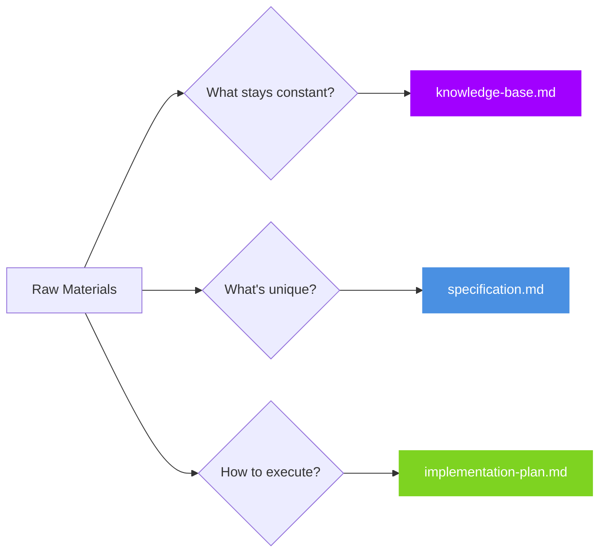

<!-- _class: hero -->

# Test Presentation

**Accenture Marp Theme**
Sample slide deck for testing

---

## Content Slide Test

This is a **regular content slide** with:

- Bullet points
- *Italic text*
- Purple accents on **bold text**

---

## Framework Overview

### The 3-Question Pattern

1. **What stays constant?** → knowledge-base.md
2. **What's unique?** → specification.md
3. **How to execute?** → implementation-plan.md

---

<!-- _class: exercise -->

## Exercise: Build Your First File

**Time**: 15 minutes

**Task**: Create knowledge-base.md from source materials

**Validation**: Instructor will review 2-3 examples

---

## Testing Complete

Theme elements verified:
✓ Hero slide
✓ Content slides
✓ Exercise styling
✓ Purple accents
✓ Clean layout

**Next**: Add Mermaid diagrams

---

## Mermaid Test: 3-Question Framework

